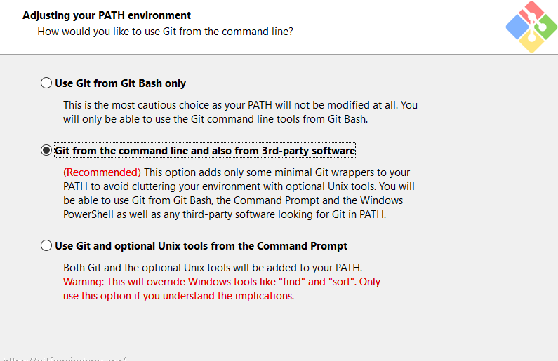
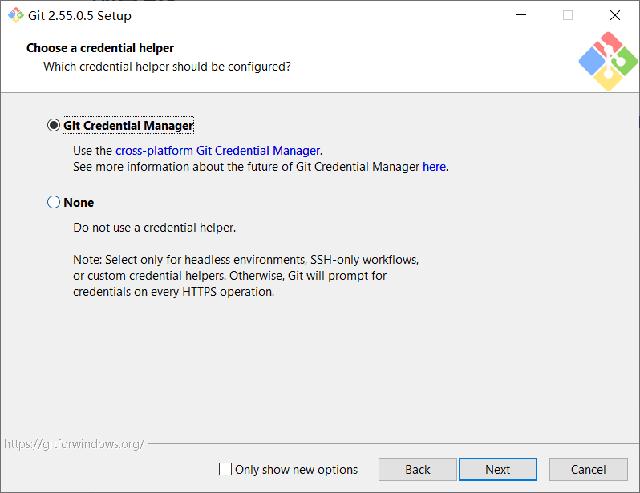

# intelligence_2027_submissions 提交教程

2027 赛季 PIONEER 算法组（视觉组）千行任务提交仓库

仓库地址：<https://github.com/SCNU-PIONEER-LEARNER/intelligence_2027_submissions>

> 完整流程：安装并配置 Git → 克隆仓库 → 创建个人分支和目录 → 提交并推送 → 发起 Pull Request（PR）。

> 以下教程含有 LLM 辅助创作内容（含人量约15%），经过人工审核校对，可以~~不那么~~放心地食用。

## 1. 提交规范

每个人在仓库根目录拥有一个自己姓名拼音的文件夹。结构示例如下：

~~~text
JiaWeisi/
|-- README.md
|-- CMakeLists.txt
|-- include/
+-- src/
~~~

在 GitHub 的个人分支命名为 `submit/姓名拼音`，例如：`submit/JiaWeisi`。推送至 GitHub 后，通过 Pull Request（PR）申请并入主分支。

如果你已成功注册并配置好 Git、GitHub，可以直接跳至[克隆仓库](#4. 克隆仓库)。

## 2. 注册 GitHub

[略](https://search.bilibili.com/all?keyword=%E6%B3%A8%E5%86%8CGithub)

## 3. 安装和配置 Git

Git 是一个分布式版本控制系统，可以记录代码修改历史、管理不同版本并支持多人协作。~~前提是别让它和 GB2312、GBK 打起来。~~

安装完成后，先配置提交记录中显示的名字和邮箱：

~~~bash
git config --global user.name "你的名字或 GitHub 用户名"
git config --global user.email "你的 GitHub 邮箱"
git config --global --list
~~~

推荐所有文本文件使用 UTF-8 编码。

### Windows

从 [Git for Windows 官网](https://git-scm.com/install/windows)下载安装最新版。安装时选择 Git Credential Manager，其余选项不确定时使用默认值或 **Recommended** 选项。





检查是否安装成功：

~~~bash
git --version  #获取当前git版本号
~~~

配置网络代理（如果你的clash或者其它代理软件用的系统端口不是默认的7890，换成你vpn的代理端口）

```bash
git config --local http.proxy http://127.0.0.1:7890
```

### Ubuntu

安装 Git 和 GitHub CLI：

~~~bash
sudo apt update
sudo apt install git gh  # 通过apt安装git和gh
git --version
~~~

登录 GitHub：

~~~bash
gh auth login
~~~

依次选择 GitHub.com、HTTPS、允许 GitHub CLI 配置 Git 身份验证，以及 Login with a web browser。终端会显示一次性验证码，按提示在浏览器中输入并授权。

使用 GitHub CLI 检查登录状态：

~~~bash
gh auth status
~~~

### WSL2

如果 Windows 已安装最新版 Git for Windows，可以让 WSL 调用 Windows 的 Git Credential Manager：

~~~bash
git config --global credential.helper "/mnt/c/Program\ Files/Git/mingw64/bin/git-credential-manager.exe"
~~~

如果 Git 安装在其他目录，请按实际路径修改。参考：[Git Credential Manager 的 WSL 文档](https://github.com/git-ecosystem/git-credential-manager/blob/main/docs/wsl.md)。

## 4. 克隆仓库

选择一个容易找到、路径中尽量不含**中文、空格、特殊字符**的位置，执行：

~~~bash
git clone https://github.com/SCNU-PIONEER-LEARNER/intelligence_2027_submissions.git
cd intelligence_2027_submissions
git remote -v
~~~

正常会看到 origin 指向：

~~~text
https://github.com/SCNU-PIONEER-LEARNER/intelligence_2027_submissions.git
~~~

## 5. 提交代码

### 第一步：同步 main

每次开始修改前先同步：

~~~bash
git switch main  # 切换到主分支
git pull --ff-only origin main  # 拉取最新版本并执行快速合并
~~~

### 第二步：创建个人分支

将示例姓名替换为自己的姓名拼音，建议使用大驼峰格式：

~~~bash
git switch -c submit/ZhangSan
git branch --show-current
~~~

此时输出应为自己的分支名，而不是 main。如果以前已经创建过该分支，直接执行以下命令切换至自己的分支：

~~~bash
git switch submit/ZhangSan
~~~

### 第三步：创建个人目录并放入代码

~~~bash
mkdir ZhangSan
~~~

此时打开资源管理器（文件管理器），进入到你clone的仓库的内部，你应该能看到一个你的名字拼音的目录（可能同时含有其他同学的目录），将你的所有代码放入你姓名拼音的目录。

### 第四步：检查并暂存

在仓库根目录文件夹执行：

~~~bash
git add ZhangSan  # 把自己的文件夹新增的代码修改提交至暂存区
git status  # 查看当前仓库版本状态
git diff --cached --stat  # 概览暂存区中将要提交的文件及代码行数变化
~~~

确认没有无关文件、其他同学的内容、大文件或敏感信息。如果误加了文件，可将它移出暂存区而不删除本地文件：

~~~bash
git restore --staged 误添加的文件路径
~~~

### 第五步：提交自己的修改

~~~bash
git commit -m "submit: add ZhangSan's thousand-line task"
~~~

先提交自己的修改，可以让工作区保持清晰，也能避免在同步主分支时丢失尚未保存的代码。

### 第六步：再次同步最新 main 并测试

千行任务通常需要开发很多天。在这段时间里，其他同学的代码可能已经合并进 main。因此，无论开始开发时是否同步过，提交 PR 前都要再同步一次：

~~~bash
git fetch origin
git merge origin/main
~~~

这两条命令会获取远程仓库的最新状态，并把最新的 main 合并进当前个人分支。其他同学已经合入 main 的目录会出现在本地，这是正常现象；只要你没有修改它们，它们不会变成你的重复提交，也不会被旧版本覆盖。

如果 Git 报告冲突，根据提示处理冲突，再执行 git add 和 git commit 完成合并。合并完成后，建议重新编译并运行自己的代码，确认最新 main 没有影响程序。

### 第七步：推送个人分支

确认同步和测试都没有问题后再推送：

~~~bash
git push -u origin submit/ZhangSan
~~~

以后在同一分支继续修改，也应保持“提交自己的修改 → 同步最新 main → 测试 → 推送”的顺序：

~~~bash
git add ZhangSan
git commit -m "fix: update task implementation"
git fetch origin
git merge origin/main
git push
~~~

## 6. 没有仓库写权限时如何提交

如果推送时出现 HTTP 403、Permission denied 或“无权向该仓库推送”，可以联系负责人开通权限，也可以使用 Fork。

> [!TIP]
>
> 优先在QQ招新群里找算法负责人或者项管开通权限

1. 打开[提交仓库](https://github.com/SCNU-PIONEER-LEARNER/intelligence_2027_submissions)。
2. 点击右上角 **Fork**，在自己的 GitHub 账号下创建副本。
3. 克隆自己的 Fork：

~~~bash
git clone https://github.com/你的GitHub用户名/intelligence_2027_submissions.git
cd intelligence_2027_submissions
~~~

4. 添加战队原仓库为 upstream：

~~~bash
git remote add upstream https://github.com/SCNU-PIONEER-LEARNER/intelligence_2027_submissions.git
git remote -v
~~~

5. 创建分支并提交自己的修改，然后同步原仓库的最新 main，测试通过后再推送：

~~~bash
git switch -c submit/ZhangSan
git add ZhangSan
git commit -m "submit: add ZhangSan's thousand-line task"
git fetch upstream
git merge upstream/main
git push -u origin submit/ZhangSan
~~~

Fork 模式下，origin 是自己的仓库，upstream 是战队原仓库。

## 7. 发起 Pull Request

推送成功后，终端通常会给出创建 PR 的链接。也可以打开 GitHub 仓库页面，点击 **Compare & pull request**。

确认：

~~~text
base repository: SCNU-PIONEER-LEARNER/intelligence_2027_submissions
base: main
compare: submit/你的姓名拼音
~~~

PR 标题建议使用：

~~~text
千行任务 姓名
~~~

PR 正文模板：

~~~markdown
## 基本信息

- 姓名：
- GitHub 用户名：
- 学院：
- 专业：

## 完成内容

-


## 其他说明

如有未完成功能、已知问题或特殊运行要求，请在这里说明。（任何你想说的内容）
~~~

创建 PR 只是发起审核，不代表已经合并。请留意审核意见。

## 8. 根据审核意见修改

不需要关闭 PR，也不需要重新创建分支。在原分支修改后继续提交和推送：

~~~bash
git switch submit/ZhangSan
git status
git add ZhangSan
git commit -m "fix: address review comments"
git push
~~~

新提交会自动出现在原 PR 中。

如果审核期间 main 有更新，可以先同步：

~~~bash
git switch main
git pull --ff-only origin main
git switch submit/ZhangSan
git merge main
git push
~~~

使用 Fork 时，从 upstream 同步：

~~~bash
git fetch upstream
git switch main
git merge --ff-only upstream/main
git push origin main
git switch submit/ZhangSan
git merge main
git push
~~~

如果出现合并冲突，不要盲目删除冲突标记或强制推送。先阅读冲突内容，无法判断时把报错和 git status 结果发给负责人。

## 9. 常见问题

### Author identity unknown

重新配置提交身份：

~~~bash
git config --global user.name "你的名字或 GitHub 用户名"
git config --global user.email "你的 GitHub 邮箱"
~~~

### Repository not found

检查仓库地址、当前 GitHub 账号和访问权限。正确克隆地址是：

~~~text
https://github.com/SCNU-PIONEER-LEARNER/intelligence_2027_submissions.git
~~~

### Permission denied 或 HTTP 403

这通常表示可以读取仓库，但没有直接推送权限。联系负责人，或按第 6 节使用 Fork。

### Failed to connect to github.com:443 / Could not connect to server

报错输出：

```
fatal: unable to access 'https://github.com/SCNU-PIONEER-LEARNER/intelligence_2027_submissions.git/': Failed to connect to github.com:443 after 21112 ms: Could not connect to server
```

执行以下命令修改git的网络代理（如果你的clash或者其它代理软件用的系统端口不是默认的7890，换成你vpn的代理端口）

```bash
git config --global http.proxy http://127.0.0.1:7890
```

### failed to push some refs 或 non-fast-forward

先确认当前在个人分支：

~~~bash
git branch --show-current
git status
~~~

不要为了省事直接使用 git push --force。先同步 main，再将它合并到个人分支；仍无法解决时联系负责人。

### LF will be replaced by CRLF

这是 Windows 和 Linux 换行符不同导致的提示，通常不代表提交失败。项目文本建议统一使用 UTF-8，不要因为这条警告反复修改所有文件。

### 文件被 .gitignore 忽略

构建目录、编译产物和缓存被忽略是正常现象。查看具体忽略规则：

~~~bash
git check-ignore -v 文件路径
~~~

确认文件确实是必要源码或配置时，可以联系负责人讨论修改 .gitignore。
